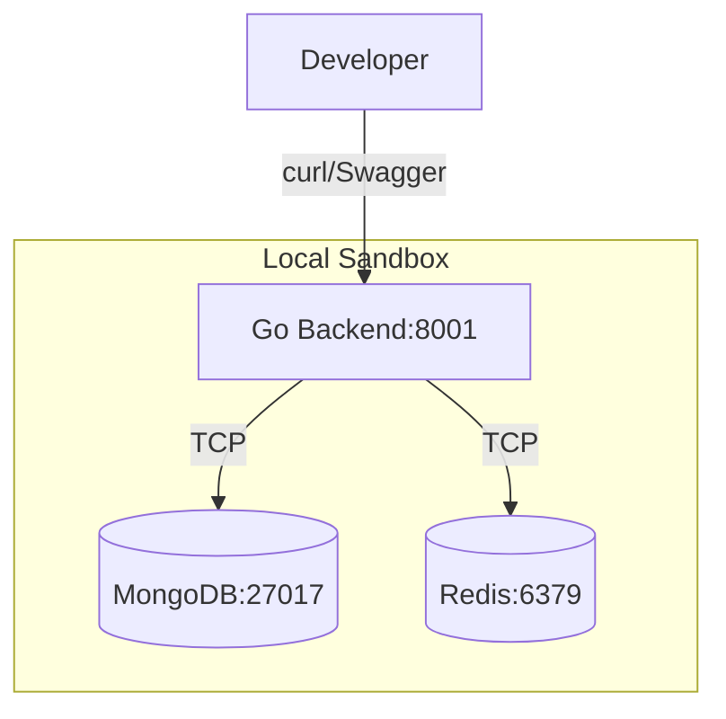
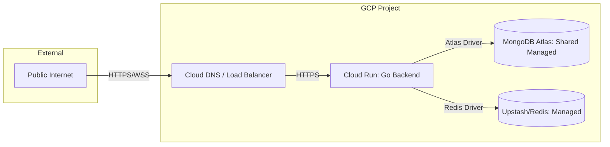
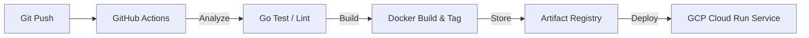

# Echo Infrastructure & Deployment

This document outlines the infrastructure strategy for the Echo Backend, focusing on containerization, high availability, and cloud-native deployment.

## 1. Local Development Stack (Docker Compose)

For local development, Echo uses a multi-container setup to ensure environment parity.

## 2. Production Architecture (GCP)

Echo is designed to be deployed as a serverless backend on **Google Cloud Platform (GCP)**.

## 3. Deployment Pipeline (CI/CD)

The transition from code to production follows a standard Automated pipeline.

## 4. Scalability Metrics

The backend is designed for horizontal scaling (Stateless).
- **Scale Out**: Cloud Run automatically scales from 0 to 100+ instances based on request CPU utilization.
- **WebSocket Scaling**: Currently handled via a single-instance Hub. Future scaling will involve **Redis Pub/Sub** to sync messages across multiple backend pods.
