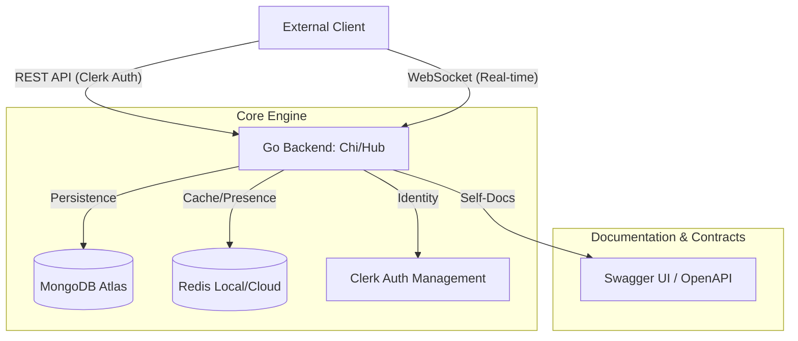
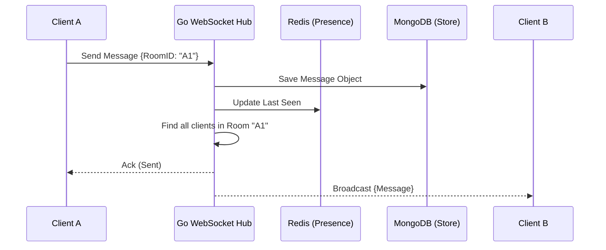
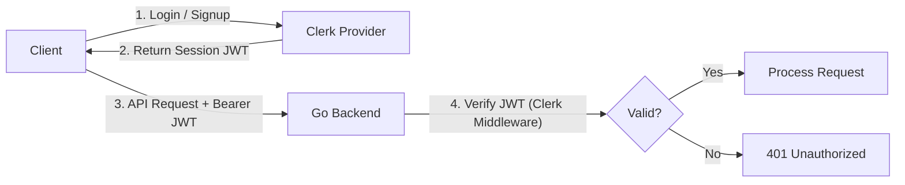

# Echo Backend Architecture

This document visualizes the core backend architecture of Echo, focusing on a high-performance, real-time messaging engine built with Go.

## 1. High-Level System Overview

The Echo Backend is a dedicated engine that handles authentication, real-time message routing, and persistent storage. External clients (Mobile, Web apps, or CLI tools) communicate via a dual-protocol interface.
<!--  -->

---

## 2. The Real-time Engine (Hub-and-Spoke)

Echo uses a **Hub-and-Spoke** architecture for real-time delivery. The Hub manages client subscriptions and broadcasts messages to the correct channels.

---

## 3. Storage & Cache Strategy

Echo balances speed and durability by using MongoDB for message history and Redis for volatile, high-speed data.

- **MongoDB**: Primary store for User Profiles, Room Metadata, and Message History. Uses TTL (Time-To-Live) indexes for ephemeral stories.
- **Redis**: Stores the "Online/Offline" status of users and handles rate-limiting to protect the API from abuse.

---

## 4. Authentication Flow (Clerk Integration)

Echo leverages **Clerk** for robust, enterprise-grade authentication. The backend verifies identities via JWT (JSON Web Tokens).

---

## 5. API Contract (Swagger)

The "Source of Truth" for all backend endpoints is the Swagger documentation.
- **Local URL**: `http://localhost:8001/swagger/index.html`
- **Dynamic Doc Generation**: Built from Go source code comments using `swaggo`.
