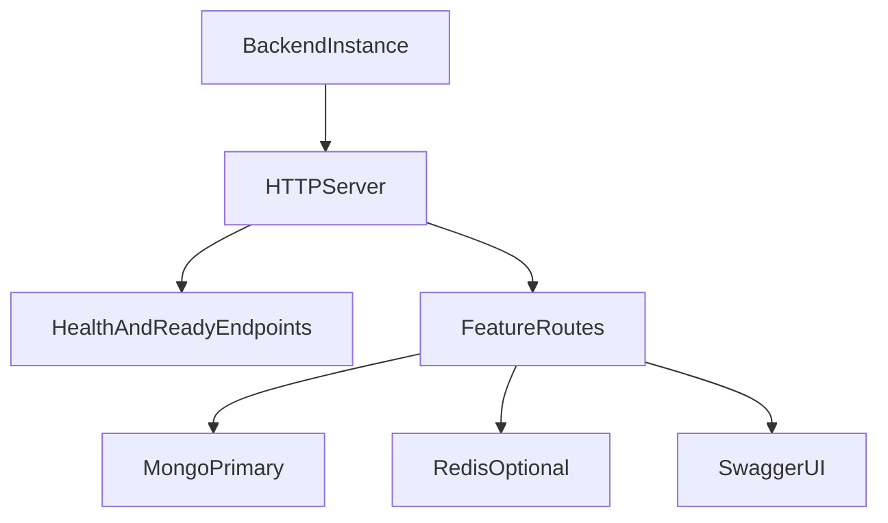

# Deployment and Runtime

```mermaid
flowchart TD
  Pod["BackendInstance"] --> Http["HTTPServer"]
  Http --> Health["HealthAndReadyEndpoints"]
  Http --> Api["FeatureRoutes"]
  Api --> Mongo["MongoPrimary"]
  Api --> Redis["RedisOptional"]
  Api --> Docs["SwaggerUI"]
```

- Graceful shutdown is enabled with signal handling.
- `/health` reports process liveness.
- `/ready` validates dependency readiness (Mongo required, Redis optional).
