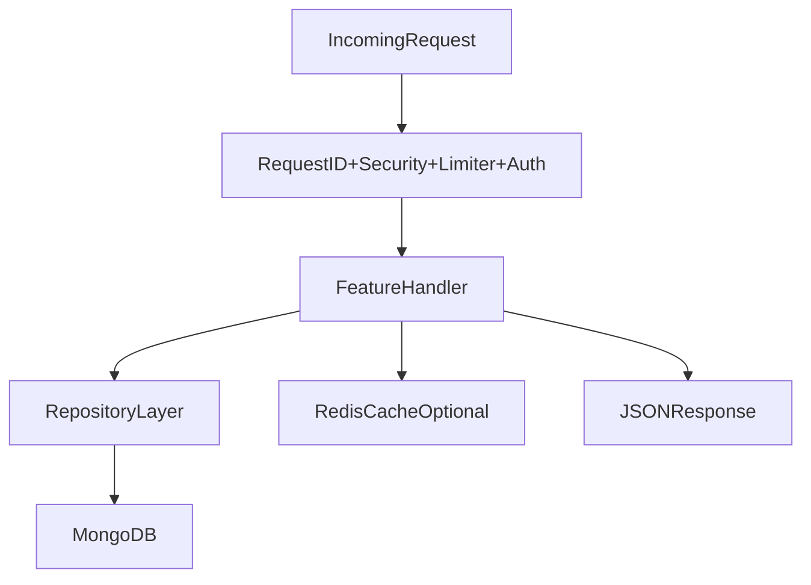
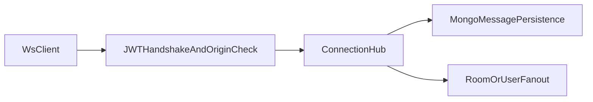

# Request Lifecycle

```mermaid
flowchart TD
  Request["IncomingRequest"] --> Mid["RequestID+Security+Limiter+Auth"]
  Mid --> Handler["FeatureHandler"]
  Handler --> Repo["RepositoryLayer"]
  Repo --> Mongo["MongoDB"]
  Handler --> Cache["RedisCacheOptional"]
  Handler --> Response["JSONResponse"]
```

For websocket:

```mermaid
flowchart LR
  WsClient["WsClient"] --> WsHandshake["JWTHandshakeAndOriginCheck"]
  WsHandshake --> WsHub["ConnectionHub"]
  WsHub --> Persist["MongoMessagePersistence"]
  WsHub --> Fanout["RoomOrUserFanout"]
```
