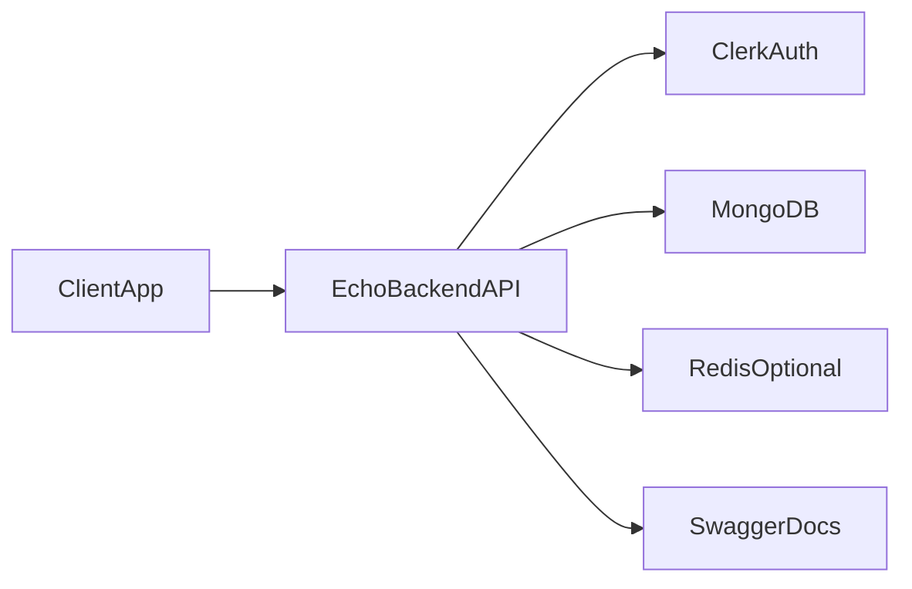

# System Context

Echo backend exposes REST and WebSocket APIs for authenticated messaging workflows.

- External auth is delegated to Clerk token verification.
- MongoDB is the source of truth for users, rooms, conversations, messages, and stories.
- Redis is optional and used for cache/presence/rate-limiting evolution.
